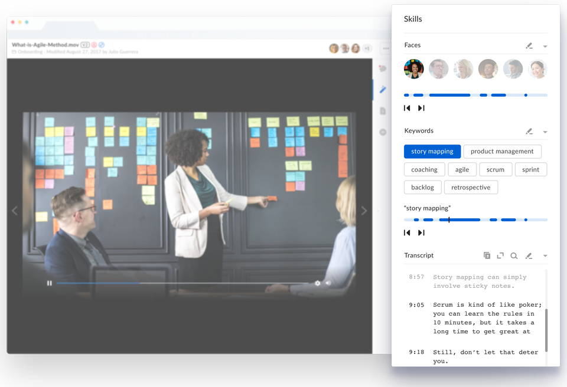

# Box Skills Kit for Node.js 

This is the official toolkit provided by [Box](https://box.com) for creating custom [Box Skills](https://developer.box.com/docs/box-skills) written in Node.js.

* [What is a Box Skill?](#WhatisaBoxSkill)
* [How does a Box Skill work?](#HowdoesaBoxSkillwork)
* [What is this toolkit for?](#Whatisthistoolkitfor)
* [Where can I learn more?](#WherecanIlearnmore)
* [Installation](#Installation)
* [Basic usage](#Basicusage)
	* [1. Reading the webhook payload](#Readingthewebhookpayload)
	* [2. Processing the file using a ML provider](#ProcessingthefileusingaMLprovider)
	* [3. Write Metadata to File](#WriteMetadatatoFile)
	* [(Optional) Deal with errors](#OptionalDealwitherrors)

## What is a Box Skill?

A Box Skill is a type of application that performs custom processing for files uploaded to Box.

Often, Box Skills leverage **third-party AI or machine learning providers** to automatically extract information from files upon upload to Box. For example, a Box Skill could automatically label objects in images using a computer vision service.

The resulting data can then be written back to the file on Box as **rich metadata** cards.



## How does a Box Skill work?

At a basic level, a Box Skill follows the following steps.

1. A file is uploaded to Box
1. Box triggers a webhook to your (serverless) endpoint
1. Your server (using the Box Skills kit) processes the webhook's event payload
1. Your server downloads the file, or passes a reference to the file to your machine learning provider
1. Your machine learning provider processes the file and provides some data to your server
1. Your server (using the Box Skills kit) writes rick metadata to the file on Box
1. Your users will now have new metadata available to them in the Box web app, including while searching for files.

## What is this toolkit for?

This toolkit helps to simplify building a custom skill in Node.js. It simplifies processing the skill event from Box, accessing your file, and writing the metadata back. 

You will still need to hook things up to your own **Machine Learning provider**, including creating an account with them. This toolkit helps you with all the interactions with Box but does not help you with the API calls to your machine learning provider.

## Where can I learn more?

For more information on Box Skills, what kind of metadata you can write back to Box, as well as visual instructions on configuring your skills code with Box, visit the [box skills developer documentation](https://developer.box.com/docs/box-skills).

Additionally, have a look at:

* More documentation on the [library's API](skills-kit-library)
* A quick start on [deploying your first skills service](boilerplate-skills)
* [More samples](https://github.com/box-community) of Box Custom Skills using various ML providers

## Installation

As the Skills Kit is currently not available through NPM the easiest way to use the library is by downloading it and linking it in your project.

```sh
# Clone the project
git clone https://github.com/box/box-skills-kit-nodejs.git
# Change into your own project
cd your_project
# Copy the skills kit library and the package.json
# with its dependencies into your project
cp -r ../box-skills-kit-nodejs/skills-kit-library .
# Link the library into your project, and download its dependencies
npm link ./skills-kit-library
```

Then, in your own code, you can include parts of the library as follows.

```js
// For more examples of the modules available within the
// library, see the rest of the documentation
const { FilesReader } = require('./skills-kit-library/skills-kit-2.0.js')
```

## Basic usage

Writing your own Custom Box Skill will change depending on your data and the machine learning provider used. A generic example would look something like this.


### <a name='Readingthewebhookpayload'></a>1. Reading the webhook payload

The way your request data (`event` in this example) comes in 
will differ depending on the web service you are using,
though in our example we are assuming you are using the Serverless framework

```js
// import the FilesReader from the kit
const { FilesReader  } = require('./skills-kit-library/skills-kit-2.0.js');
// Here, event is the webhook data received at your endpoint.
const reader = new FilesReader(event.body);  

// the ID of the file
const fileId = reader.getFileContext().fileId;
// the read-only download URL of the file
const fileURL = reader.getFileContext().fileDownloadURL;
```

### <a name='ProcessingthefileusingaMLprovider'></a>2. Processing the file using a ML provider

This part will heavily depend on your machine learning provider. In this example we use a
theoretical provider called `MLProvider`.

```js
const { MLProvider } = require('your-ml-provider');
// import the SkillsWriter and SkillsErrorEnum from the kit
const { SkillsWriter, SkillsErrorEnum } = require('./skills-kit-library/skills-kit-2.0.js');

// initialize the writer with the FilesReader instance,
// informing the writer how to and where to write any metadata
const writer = new SkillsWriter(reader.getFileContext());

// Write a "Processing"-card as metadata to the file on Box, 
// informing a user of the skill in process.
await writer.saveProcessingCard();

// Finally, kick off your theoretical machine learning provider
try {
  // (this code is pseudo code)
  const data = await new MLProvider(fileUrl).process()
} catch {
  // Write an "Error"-card as metadata to your file if the processing failed
  await writer.saveErrorCard(SkillsErrorEnum.FILE_PROCESSING_ERROR);
}
```

### <a name='WriteMetadatatoFile'></a>3. Write Metadata to File

Finally, once your machine learning provider has processed your file, you can write the data received from them as various forms of **metadata** to a file.

```js
// In this case we assume your data is some kind of array of objects with keywords
// e.g.:
// [
//   { keyword: 'Keyword 1' },
//   { keyword: 'Keyword 2' },
//   { keyword: 'Keyword 1' },
//   ...
// ]
let entries = [];
data.forEach(entry => {
  entries.push({
    type: 'text',
    text: entry.keyword
  })
});

// Convert the entries into a Keyword Card
const card = writer.createTopicsCard(entries);

// Write the card as metadata to the file
await writer.saveDataCards(card);
```

### <a name='OptionalDealwitherrors'></a>(Optional) Deal with errors

In any of these steps a failure, either when reading the file, processing the file, or writing the metadata to the file.

The skills kit makes it simple to write powerful error messages to your file as metadata cards.

```js
const { SkillsErrorEnum } = require('./skills-kit-library/skills-kit-2.0.js');
await writer.saveErrorCard(SkillsErrorEnum.FILE_PROCESSING_ERROR);
```

See the Skills Kit API documentation for a [full list of available errors](skills-kit-library#error-enum).
